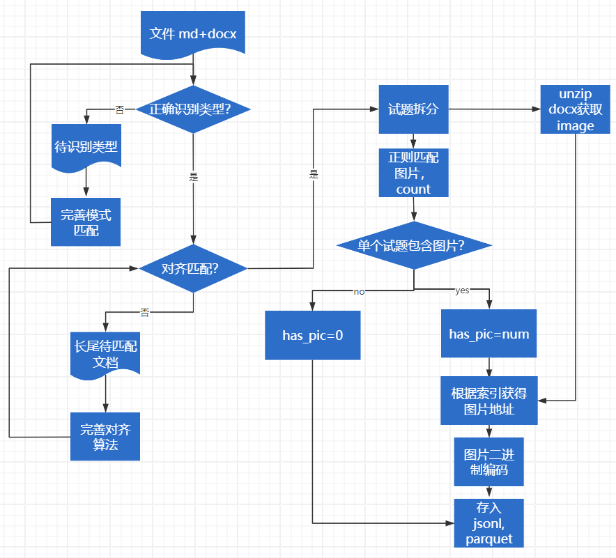

用来对试卷（md+docx格式）进行模式识别，对齐以及拆分，最后转成jsonl以及parquet的整套自动化处理代码。文档中的图片将以base64格式跟随出现的试题进行存储。

## 使用
```python
python extract_and_align_exam.py --input_dir  "" --output_file "" --notRec_dir "" --fail_dir ""


```

